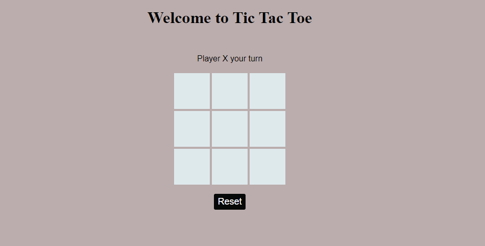
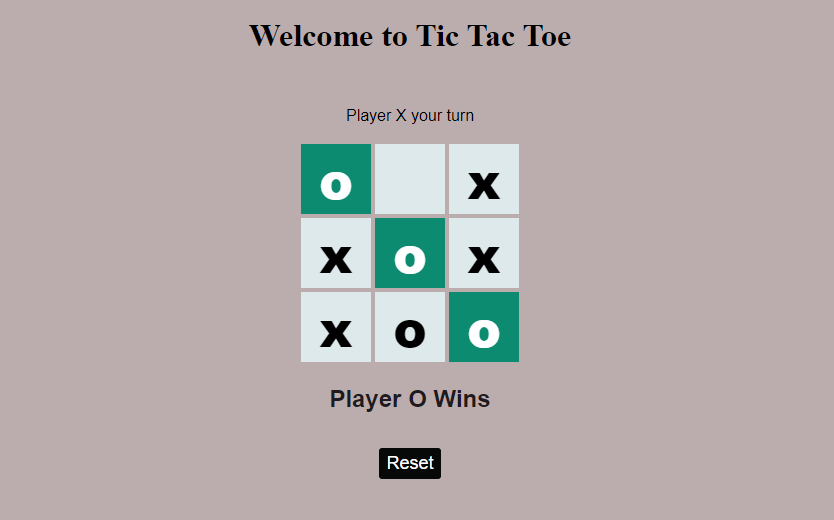

# TicTacToe-JavaScript
Tic-tac-toe (also called noughts and crosses) is a pencil-and-paper game for two players, X and O, who take turns marking the spaces in a 3×3 grid. The player who succeeds in placing three of their marks in a horizontal, vertical, or diagonal row wins the game.

* Tic-tac-toe (or  tic-tac-to, tic tac toe for short) is a paper-and-pencil game for two players, X and O, who take turns marking the spaces in a 3×3 grid. The player who succeeds in placing three of their marks in a horizontal, vertical, or diagonal row wins the game
* Tic-Tac-Toe, also known as Noughts and Crosses, is a great game for kids. Two players take turns putting an X or an O in the spaces of a 3×3 grid to make a square. The first player to complete three in a row wins.
* Tic tac toe is one of the easiest, but most strategic board games. The game can be played by children as young as 3 years old. The rules are simple, and the game can be broken up into smaller games depending on age or skill level.
* The tic tac toe game is also known as noughts and crosses. It has been played for many years, it originated in the most ancient times. The game is played by two people, you can play it almost everywhere and the best of all is that it’s free

##### You can play it with your friends, family, and others
